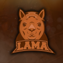

<br/>
<p align="center">
  <a href="https://github.com/spinshock/llama-bot-discord">
    
  </a>

  <h3 align="center">Llama bot for Discord</h3>

  <p align="center">
    Llamify your discord channel
    <br/>
    <br/>
    <a href="https://github.com/spinshock/llama-bot-discord">View Demo</a>
    .
    <a href="https://github.com/spinshock/llama-bot-discord/issues">Report Bug</a>
    .
    <a href="https://github.com/spinshock/llama-bot-discord/issues">Request Feature</a>
  </p>
</p>


## Table Of Contents

* [About the Project](#about-the-project)
* [Built With](#built-with)
* [Getting Started](#getting-started)
  * [Prerequisites](#prerequisites)
  * [Installation](#installation)
* [Usage](#usage)
* [Roadmap](#roadmap)
* [Contributing](#contributing)
* [License](#license)
* [Authors](#authors)
* [Acknowledgements](#acknowledgements)

## About The Project

Discord bot made for Llamas. Express your emotions using a large emote database. Extend the collection of emotes by adding your own for your channel.

## Built With

### API
- node
- typescript
- express
- typeorm connection with postgresql

### BOT
- discord.js
- typescript

### CLIENT
- react w/ typescript

## Getting Started

This is an example of how you may give instructions on setting up your project locally.
To get a local copy up and running follow these simple example steps.

### Prerequisites

* docker
* docker-compose
* node and nvm
* [Discord Bot Token](https://discord.com/developers/applications/)
* postgresql db

### Installation

1. Clone the repo

```sh
git clone https://github.com/spinshock/llama-bot-discord.git
```

1. NPM install in all three modules 
```bash
cd ./llama-bot && npm install
```
```bash
cd ./llama-bot-api && npm install
```
```bash
cd ./llama-bot-client && npm install
```

1. TODO

## Usage

Use this space to show useful examples of how a project can be used. Additional screenshots, code examples and demos work well in this space. You may also link to more resources.

_For more examples, please refer to the [Documentation](https://example.com)_

## License

Distributed under the MIT License. See [LICENSE](https://github.com/spinshock/llama-bot-discord/blob/main/LICENSE.md) for more information.

## Authors

* **Yavor Filipov** - *Software Engineer* - [Yavor Filipov](https://github.com/spinshock/) - *Built Llama bot*

## Acknowledgements

* [ShaanCoding](https://github.com/ShaanCoding/) - readme template author
* [Othneil Drew](https://github.com/othneildrew/Best-README-Template) - readme template author
* [ImgShields](https://shields.io/)
